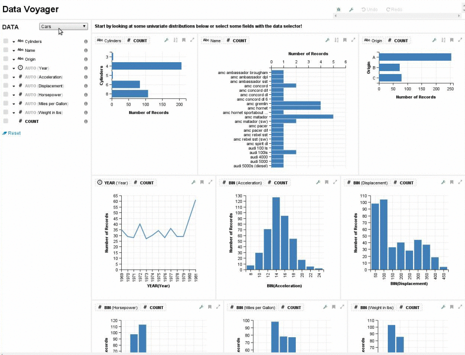

# REST adapter for osquery compatible with Vega

This adapter allows you to visualize information about your OS, for example see running processes, hardware devices or opened ports. It does that by  making [osquery](https://osquery.io/) data available as a REST endpoint. You can than browse and visualize the information using [Voyager](https://www.github.com/vega/voyager) or [Polestar](https://www.github.com/vega/polestar).



## Use

Install: `npm install -g osquery-rest-adapter`

Run it: `osquery-rest-adapter`

Use different port: `PORT=3003 osquery-rest-adapter`

## Prerequisites

1. [Install osquery](https://osquery.io/downloads/)
2. Download [Voyager](https://www.github.com/vega/voyager) or [Polestar](https://www.github.com/vega/polestar)
3. In your Voyager or Polestar source in the file `bower_components/vega-lite-ui/vlui.js` change value of `myriaRest`to `http://localhost:8080`
4. After opening Voyager or Polestar, select a dataset using *Add a dataset from Myria*

## Standalone queries

This adapter is best used by visualization tools. But you can also use the REST endpoint directly.

### Get list of available datasets

You can use optional `q` parameter for search.

`curl localhost:8080/dataset/search?q=usb`

```
[{
  "userName": "local",
  "programName": "osquery",
  "relationName": "usb_devices"
}]
```

### Fetch a dataset

In this example we fetch list of `usb_devices` in the system.

`curl localhost:8080/dataset/user-local/program-osquery/relation-usb_devices/data`
